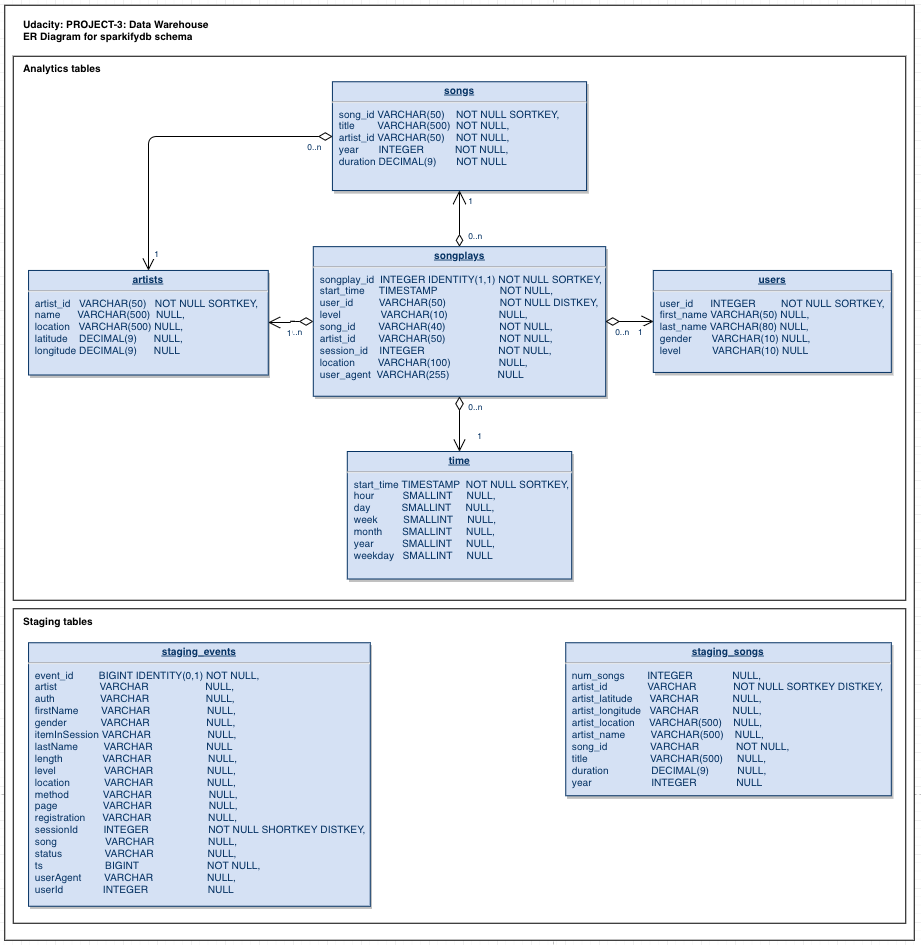

# Sparkify ETL From Transaction to Analytics - Redshift
This ETL utilizes the transaction tables created by Sparkify users and transforms that data into analytics tables with a *Star Schema* design.

*Star Schema* design when applied to databases is when the database consists of one fact table surrounded by dimension tables (supporting tables). These supporting tables have a one-to-one relationship with the central table (facts table) and joining the fact tables to a supporting dimension table is linear and straightforward.
Such designs are used mostly for analytics databases, where inserts are not that common nor the latency is a important factor in the table design. These designs make it retrieving the whole dataset to perform analytcs on it very easy, and can be integrated into a reporting layer rather fast.

### Database Design:



## Running the ETL
First and foremost, run the step on the jupyter notebook *create_redshift_cluster.ipynb*. This will create all the resources necessary and launch the Redshift cluster. 
 - Cluster: 4x dc2.large nodes
 - Location: us-west-2
 
 IMPORTANT: Do Not Forget to ShutDown the Cluster when finished.
 
 ### Source Data
 The data serving as input data for the ETL is gonna be 2 datasets resulting from the transactional data created by the users of the app.
  - Events(logs): event data describing users actions in the app, along with timestamps, sessions ids, songs listened to, etc..
  - Songs: information about songs and artists
 
 These datasets can be found in the JSON format in a publicly avaialble S3 bucket: s3://udacity-dend (/log_data, /song_data)
 
 This datasets contain very much raw untreated data. Many layers of cleansing can be performed before transferring into the analytcs database. That sort of cleansing was not performed during this ETL, but can easily be added to it. This led to the tables were data is going to be loaded to have to support those data anomalies, such as extra long fields ( VARCHAR(500)).
 #### Staging tables:
  - Songs: loads the data from the songs JSON files. 
  - Events: loads the data from the logs JSON files, uses the JSONPATH provided here: /log_json_path.json
 
 ### Analytics Data
 #### Fact Table
 Songlplay is going to serve as our fact table for this database. This will contain the songplay data. The following schema was chosen for this table:
 ```
 (
  songplay_id INTEGER IDENTITY(0,1) NOT NULL SORTKEY,
  start_time TIMESTAMP NOT NULL,
  user_id VARCHAR(100) NOT NULL DISTKEY,
  level VARCHAR(10) NOT NULL,
  song_id VARCHAR(40) NOT NULL,
  artist_id VARCHAR(50) NOT NULL,
  session_id VARCHAR(50) NOT NULL,
  location VARCHAR(100),
  user_agent VARCHAR(255)
);
```
Noticing the use of dist key, to increase the table performance, since this tables might become rather large, is important to split it between multiple nodes. The userID is chosen as the dist key, since this should be a rather balanced key ( normal distributed). Songplay ID is chosen as the sort key - also for performance reasons, makes it easier to retrieve data

#### Dimension tables
 - Users: Stores all user information, names, gender, level. UserID used as a SORT KEY
 - Songs: Stores all songs information, such as title, year, duration. SongID used as a SORT KEY
 - Artists: Stored all artist information, name, location. This table is loaded with a diststyle of ALL. This should be a rather small table, having it in all nodes will increase the speed at which data can be fetched (joined to fact table). ArtistID used as a SORT KEY
 - Time: Detailed information about the timestamp of a song. TS is the main key here, then for each timestamp the hour, day, week, etc, it represents its stored here. This makes it easy to fetch information about the day a specific song got played, by its timestamp. No further calculation needs to be performed. Data is readily available. Also, this is wil have a ALL distribution type, since it will be a rather small table. 

### Running the ETL
#### create_tables.py
This will use the file *sql_queries* and retrieve all create tables queries. This script will handle deleting any tables, if they exist, and recreating them.
The script should always be the first step in performing this ETL job.
#### etl.py
This script will then load the data from the JSON files to the Staging tables. This will be achieved by using the very useful functionality of the COPY command from Redshift. This command allows to load data from S3 straight to a Redshift table. A JSON path might be needed if there is complex nested structures in the JSON, or any sort if interpretation is needed.

After the raw data is loaded into the staging tables, the Inserting into the Star Schema database can take place. There is logic to be followed here, depending on the table being loaded. The logic lies inside the insert query itself. Extra logic can be given or extra cleansing steps can be performed. This ETL job is rather simple.
Across all tables, the only logic being followed is to only insert data that does already exist in the table itself. This is useful if this ETL is suppose to be run on a schedule, for example, daily, and new data is being provided (new JSON files). By using the primary key if the table it is being inserted to, the logic will ignore data that already exists in the destination table.

Follows as an example, for the *Songplay* table, the userID belonging to the data being inserted cannot be already in the *Songplay* table with the following conditions:
- same userID
- same start_time
- same session_id
What the above conditions mean, in terms of the webapp semantics is: The song tried to be inserted already exists for this user, in this session id with this start timestamp. In other words, the song listened to during session ID x at 13:05 by user A already exists in the table.

Similar insert conditions are provided in all other insert queries. Such as *this song_id already exists in the table* - no need to insert it again.
This allows for very fast inserts into the tables, since most of the data in the staging tables might already exists in the dimension/fact tables.

## Analytics Queries Examples:
This query can retrieve all songs played at a certain timestamp
```
SELECT  sp.songplay_id,
        u.user_id,
        s.song_id,
        u.last_name,
        sp.start_time,
        a.name,
        s.title
FROM songplays AS sp
        JOIN users   AS u ON (u.user_id = sp.user_id)
        JOIN songs   AS s ON (s.song_id = sp.song_id)
        JOIN artists AS a ON (a.artist_id = sp.artist_id)
        JOIN time    AS t ON (t.start_time = sp.start_time)
WHERE sp.start_time= 'TIMESTAMP'
LIMIT 1000;
```